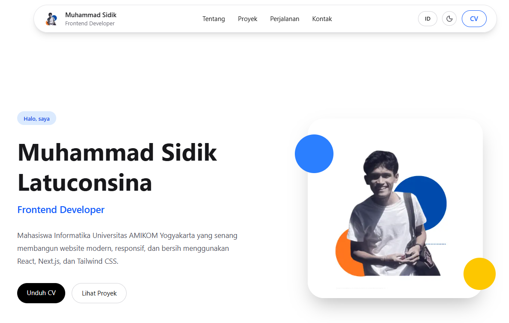

# Muhammad Sidik Latuconsina Portfolio

A modern and responsive personal portfolio website built with **Next.js**, **TypeScript**, and **Tailwind CSS**. This portfolio showcases my projects, technical skills, and experience as an aspiring Frontend & Full Stack Developer.

## Live Demo

 https://muhammad-sidik-portfolio.vercel.app/

## Preview

> Add a screenshot of the homepage here.



---

## Features

- 🌙 Dark Mode
- 🌐 Bilingual (English & Indonesian)
- 📱 Fully Responsive Design
- ⚡ Smooth Scroll Navigation
- 🎨 Modern UI Design
- 📂 Project Showcase
- 📄 Download CV
- 📞 Contact Section

---

## Tech Stack

### Frontend

- Next.js
- React
- TypeScript
- Tailwind CSS

### Deployment

- Vercel

### Tools

- Git
- GitHub
- VS Code

---

## Featured Projects

### InternHub

Internship Management System built using Next.js, TypeScript, Tailwind CSS, Prisma, and PostgreSQL.

🔗 Live Demo  
https://internhub-nextjs.vercel.app/

🔗 Repository  
https://github.com/MuhammadSdk/internhub-nextjs

---

### Website Joglo Dhepis

Company Profile Website developed using Next.js and Tailwind CSS.

🔗 Live Demo  
https://joglodhepis.vercel.app/

---

## Folder Structure

```text
app/
components/
context/
data/
public/
styles/
```

---

## Installation

Clone this repository

```bash
git clone https://github.com/MuhammadSdk/muhammad-sidik-portfolio.git
```

Go to project folder

```bash
cd muhammad-sidik-portfolio
```

Install dependencies

```bash
npm install
```

Run development server

```bash
npm run dev
```

Open

```
http://localhost:3000
```

---

## Contact

**Muhammad Sidik Latuconsina**

ltcnsnadidi@gmail.com

LinkedIn  
https://www.linkedin.com/in/m-sidik-25aa02275

GitHub  
https://github.com/MuhammadSdk

---

## License

This project is created for personal portfolio purposes.